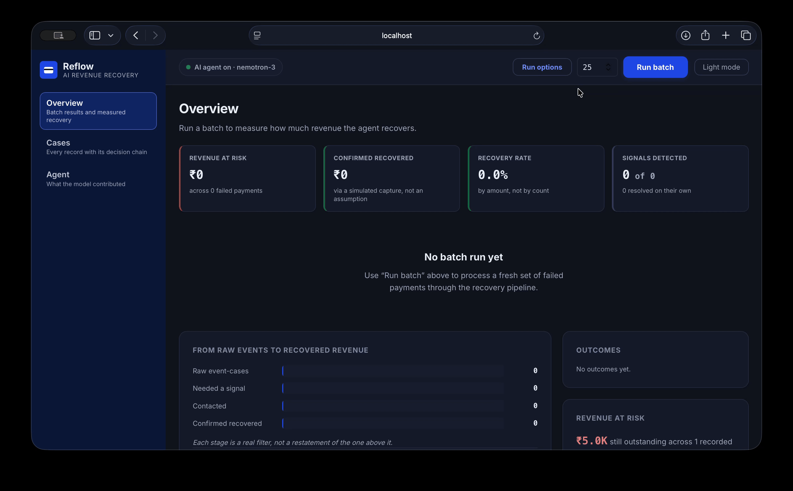

# Reflow

**Failed-payment & subscription recovery agent.**


A safety-first recovery pipeline for failed Razorpay-style payment events. The system classifies failures with deterministic rules, evaluates bounded recovery policy, asks NVIDIA NIM (Nemotron) for an explanation, executes only policy-approved actions in a sandbox executor, and appends every result to a SQLite audit log for the React dashboard.

> **Rules decide. Nemotron explains. The executor acts. The audit log records.**

## Demo

<!-- Once recorded, drop the file at docs/demo.gif and uncomment:

-->
_Demo recording goes here — capture the console processing a recoverable payment, then refusing the three adversarial cases (over-cap amount, past retry limit, unknown cause). Save it as `docs/demo.gif` and uncomment the line above._

## Current implementation status

The golden path is implemented end to end with synthetic/Razorpay-shaped events:

```text
payment event → rules-first classification → bounded policy decision
→ Nemotron explanation (or safe fallback) → mock execution → escalation/audit → dashboard
```

The current `MockExecutor` simulates recovery and does not call Razorpay. Razorpay credentials are reserved in `.env.example` for a future adapter; no secrets are required to run the current demo or test suite.

## Architecture

```text
                         Failed payment event
                                  │
                                  ▼
                       ┌────────────────────┐
                       │ Ingestion / Pydantic│
                       │ event validation    │
                       └──────────┬─────────┘
                                  ▼
                       ┌────────────────────┐
                       │ FailureClassifier  │
                       │ deterministic rules│
                       └──────────┬─────────┘
                                  ▼
                       ┌────────────────────┐
                       │ RecoveryPolicyEngine│
                       │ bounded authority   │
                       └───────┬────────────┘
                               │
                 ┌─────────────┴─────────────┐
                 ▼                           ▼
       ┌────────────────────┐      ┌──────────────────┐
       │ RecoveryReasoner   │      │ EscalationHandler│
       │ Nemotron via NIM   │      │ fail-closed      │
       │ explanation only   │      └────────┬─────────┘
       └──────────┬─────────┘               │
                  └──────────────┬─────────┘
                                 ▼
                       ┌────────────────────┐
                       │ RecoveryExecutor   │
                       │ MockExecutor today │
                       └──────────┬─────────┘
                                  ▼
                       ┌────────────────────┐
                       │ Append-only SQLite │
                       │ AuditLogger        │
                       └──────────┬─────────┘
                                  ▼
                       ┌────────────────────┐
                       │ React + TypeScript │
                       │ operations dashboard│
                       └────────────────────┘
```

Every event is traceable as:

```text
CAUSE → RULE → BOUND → ACTION → OUTCOME
```

Nemotron receives the event, classification, and already-computed policy decision. Its output is display-only. If the NIM API is unavailable, times out, or returns malformed JSON, the reasoner creates a deterministic fallback without changing the policy decision.

## Failure taxonomy

| Category | Typical signals | Policy action |
| --- | --- | --- |
| `insufficient_funds` | Balance/insufficient-funds message or code | Scheduled retry |
| `expired_card` | Expired card or inactive mandate signal | Trigger re-authorization |
| `network_error` | `GATEWAY_ERROR`, timeout, network failure | One immediate retry |
| `bank_decline` | Issuer/card decline signal | Switch payment method |
| `authentication_failure` | OTP, 3DS, or authentication failure | Resend auth prompt |
| `unknown` | No clean rule match | No automatic action; escalate |

Classification is local, deterministic, and rules-first. Specific error codes take precedence over message patterns; ambiguous events fail closed.

## Recovery policy and safety limits

| Root cause | Action | Category limit |
| --- | --- | --- |
| Insufficient funds | Retry after the 24-hour policy cooldown | Maximum 2 retries |
| Expired card/mandate | Trigger re-authorization | 1 attempt |
| Network/gateway error | Immediate retry | 1 retry |
| Bank decline | Switch to an alternate method | 1 switch |
| Authentication failure | Resend authentication prompt | 1 resend |
| Unknown | Escalate | 0 automatic actions |

Global guards are enforced by `RecoveryPolicyEngine`:

- Maximum 3 total automated attempts per transaction.
- Automatic recovery is disabled above `AUTO_RECOVERY_AMOUNT_LIMIT` (default: `500000` paise / ₹5,000).
- Invalid amounts, missing classifications, exhausted limits, and unknown failures escalate.
- The executor runs only when `automatic_recovery_allowed` is true.
- Escalations, stops, execution failures, reasoning failures, and audit failures are recorded.
- Neither Nemotron nor the dashboard can authorize or expand a recovery action.

## API

Start the backend from the `backend/` directory. It exposes:

| Method | Endpoint | Purpose |
| --- | --- | --- |
| `GET` | `/health` | Service health check |
| `POST` | `/api/dashboard/process` | Process one validated payment event |
| `GET` | `/api/dashboard/audit` | Read the append-only audit records |

Amounts are supplied in the smallest currency unit (for INR, paise). A minimal request looks like:

```json
{
  "event_id": "evt_demo_001",
  "razorpay_payment_id": "pay_test_demo_001",
  "merchant_id": "merch_01",
  "customer_id": "cust_001",
  "type": "one_time",
  "amount": 149900,
  "currency": "INR",
  "payment_method": "upi",
  "error_code": "INSUFFICIENT_FUNDS",
  "error_description": "Payment failed due to insufficient funds",
  "failure_category": "unknown",
  "attempt_number": 1,
  "mandate_status": null,
  "timestamp": "2026-09-02T10:00:00Z"
}
```

The submitted `failure_category` is part of the validated event schema; the backend independently derives the effective category with `FailureClassifier`.

Audit records persist to `DATABASE_URL` (default `sqlite:///./recovery.db`), so they survive a backend restart. `GET /api/dashboard/audit` supports pagination and filtering: `?limit=&offset=` page the log (omit `limit` to return all) and `?outcome=recovered` filters by final outcome; the response includes `count` (this page) and `total` (all matching records).

## Quick start

### Backend

```bash
cd backend
python3 -m venv .venv
source .venv/bin/activate
pip install -r requirements.txt
cp .env.example .env
uvicorn app.main:app --reload
```

NIM is optional for the pipeline: without a reachable NIM API, Nemotron explanations become safe deterministic fallbacks. To use live explanations, set `NIM_API_KEY` and ensure the model named by `NIM_MODEL` is available on the NIM catalog.

### Frontend

In a second terminal:

```bash
cd frontend
npm install
npm run dev
```

Open the Vite URL shown in the terminal (normally `http://localhost:5173`). The frontend calls `http://localhost:8000` by default. Set `VITE_API_BASE` if the backend is hosted elsewhere.

## Demo and evaluation

Run the five safety/demo scenarios from `backend/`:

```bash
python verify_demo.py
```

This covers a recoverable insufficient-funds event, retry-limit escalation, unknown-failure escalation, amount-cap escalation, and a simulated executor failure.

Generate the deterministic 80-event dataset (80% development, 20% held-out):

```bash
python -m app.ingestion.generator
```

Run evaluation against both datasets:

```bash
python evaluate.py
```

Evaluation reports are written to `backend/evaluation_results/` and include classification accuracy, automatic recoveries, escalations, execution failures, unknown/unsafe cases, and false automatic recoveries.

### Evaluation integrity

Classification is driven by the structured `error_code` — the same signal a real Razorpay integration receives — not by keyword-matching the event's free-text description. The generator keeps descriptions independent of the classifier's message rules, and the held-out slice is re-worded from a disjoint phrase pool, so held-out accuracy measures genuine generalization to unseen wording rather than the dataset echoing the classifier's own keywords back at it.

## Tests

Backend tests:

```bash
cd backend
pytest
```

Frontend tests and production build:

```bash
cd frontend
npm test
npm run build
```

The test suite covers classification, every policy rule, stopping rules, fail-closed behavior, reasoning fallbacks and policy isolation, execution idempotency, audit persistence/redaction, API health, pipeline integration, dashboard rendering, and security hardening.

## Project structure

```text
.
├── backend/
│   ├── app/
│   │   ├── audit/          # append-only SQLite audit store
│   │   ├── classifier/     # deterministic failure taxonomy
│   │   ├── escalation/     # human-review/fail-closed handling
│   │   ├── evaluation/     # synthetic and held-out evaluation
│   │   ├── executor/       # executor contract and MockExecutor
│   │   ├── ingestion/      # event generator and loader
│   │   ├── models/         # Pydantic payment-event schema
│   │   ├── pipeline/       # end-to-end orchestration
│   │   ├── policy/         # authoritative bounded policy engine
│   │   ├── reasoning/      # Nemotron/NIM explainer and fallback
│   │   ├── dashboard.py    # FastAPI dashboard endpoints
│   │   └── main.py         # FastAPI application
│   ├── tests/
│   ├── evaluate.py
│   └── verify_demo.py
├── data/
│   ├── synthetic/          # development dataset
│   └── held_out/           # held-out evaluation slice
└── frontend/
    └── src/                # React dashboard and API client
```

## Configuration

Copy `backend/.env.example` to `backend/.env` and adjust as needed:

```dotenv
RAZORPAY_KEY_ID=
RAZORPAY_KEY_SECRET=
NIM_API_KEY=
NIM_BASE_URL=https://integrate.api.nvidia.com/v1
NIM_MODEL=nvidia/nemotron-3-nano-omni-30b-a3b-reasoning
DATABASE_URL=sqlite:///./recovery.db
AUTO_RECOVERY_AMOUNT_LIMIT=500000
CORS_ALLOW_ORIGINS=http://localhost:5173,http://localhost:3000
```

Do not commit `.env` files, Razorpay credentials, or model/API tokens. The audit logger recursively redacts credential-like fields before persistence.

## Design boundary

The project intentionally keeps authorization deterministic:

1. `FailureClassifier` identifies the failure category.
2. `RecoveryPolicyEngine` decides whether an action is allowed and which bounds apply.
3. `RecoveryReasoner` explains that decision; it cannot modify it.
4. `RecoveryExecutor` performs only an authorized action and returns a structured result.
5. `EscalationHandler` routes denied/failed/unsafe cases without authorizing recovery.
6. `AuditLogger` appends the complete outcome for inspection.

This boundary is the core safety property of the recovery agent.
